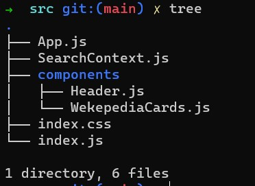

# task-nadfost-wekepedia-api

## this is a task for build app about the wikipwdia api using reactjs/css

## **Technoclogies**

- Reactjs/useContext
- CSS

## Structure Files

in the src folder you will see these strucure for this folder

**as you see in the picture we have inside the src folder a componenets folder which is contains a files that i am created to build this app**

we have :

- index.css whi is contains all css codes for styling

- SeachContext wich is contains all functions and states using context .

- App.js contains a header and wekepidaiCard to render the page

* in the compnonets folder we have:
  - Header.js compnent wich is contains a form input search to serach about article
  - WekeoediaCard.js to render the title and descreption about the articles that we searched about it.
